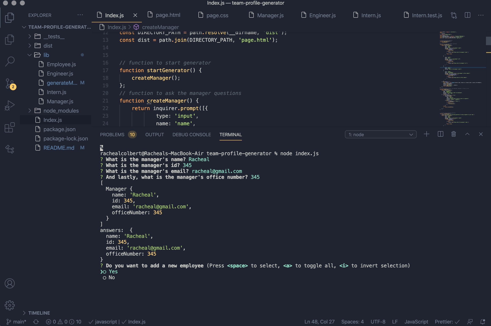

# Team Profile Generator

This is a Node.js command-line application that takes in information about employees on a software engineering team and generates an HTML webpage that displays summaries for each person.

**Link to GitHub Repo:** https://github.com/rachealcolbert/team-profile-generator

**Screenshot of Application:**

## Description

When a user starts the application, they are prompted to enter the team manager’s name, employee ID, email address, and office number. After entering the team manager’s name, employee ID, email address, and office number, they are presented with a menu with the option to add an engineer or an intern or to finish building the team.

If they select the engineer option, they are prompted to enter the engineer’s name, ID, email, and GitHub username, and are then taken back to the menu. If they select the intern option, then they are prompted to enter the intern’s name, ID, email, and school, and are then taken back to the menu.

When a user decides to finish building the team, they exit the application and an html page is generated.

The application will be invoked by using the following command: **node index.js**

## Table of Contents

- [Installation](#installation)
- [Usage](#usage)
- [Credits](#credits)
- [Contributing](#contributing)

## Installation

The command that should be run to install dependencies is npm i.

## Usage

To invoke the application, use the command **node index.js** in the terminal.

## Credits

The creator of this project's email and GitHub is below.

- [GitHub](https://github.com/rachealcolbert)
- rachealcolbert16@gmail.com

## Contributing

No contributions are needed on this project.
